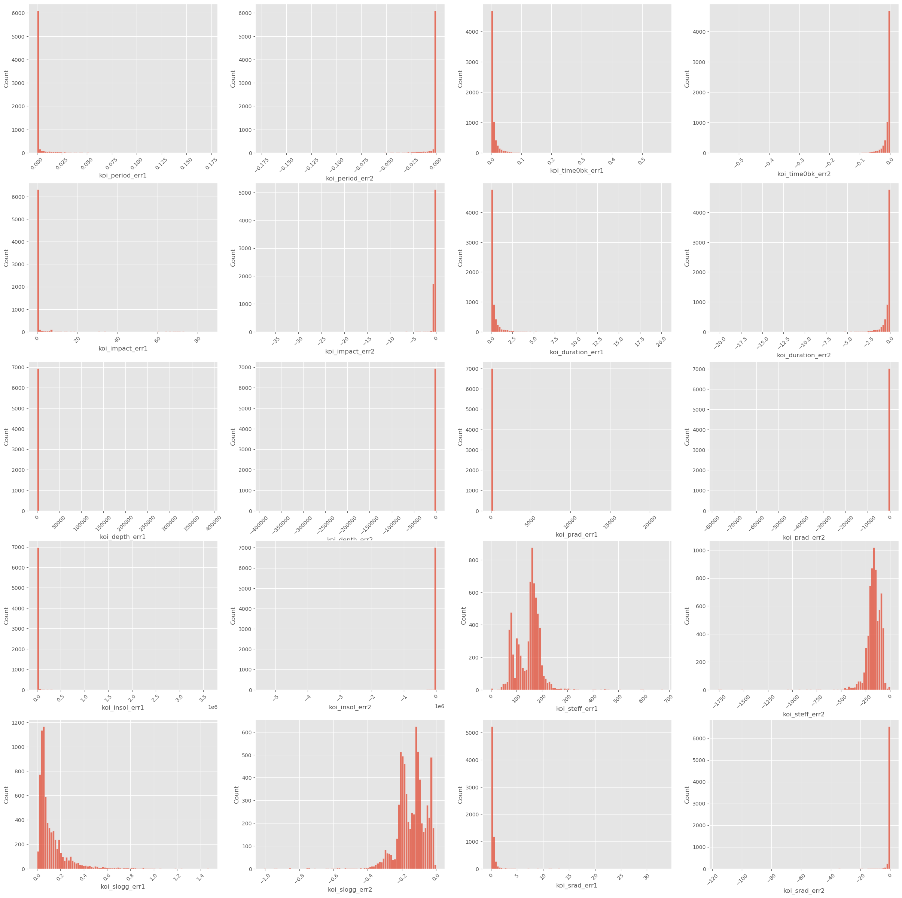
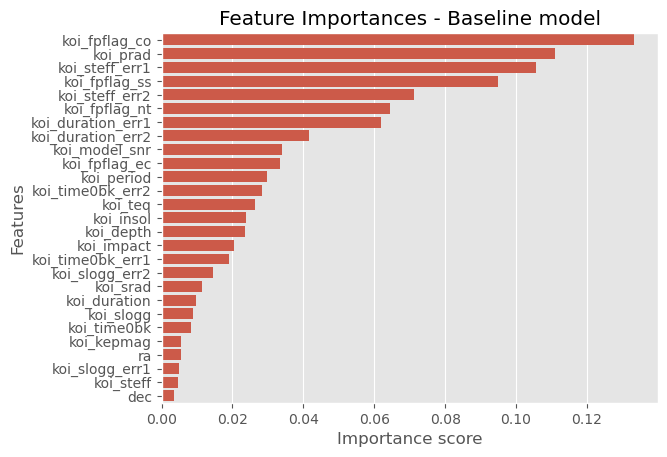
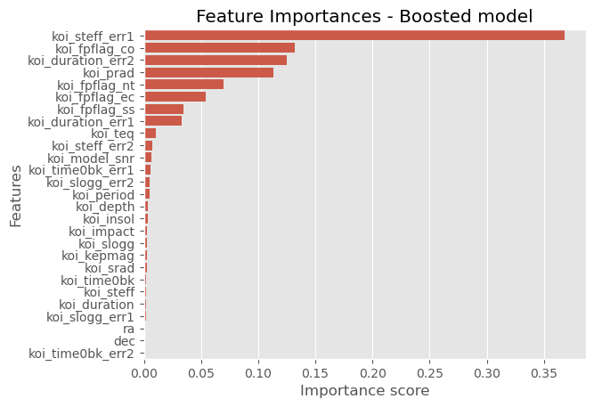

# Exoplanet-Candidate-Identification

A project where I train a model to identify if a candidate transit is an exoplanet or a false positive.

## Dataset

The dataset for this project was taken from [this Kaggle dataset](https://www.kaggle.com/datasets/nasa/kepler-exoplanet-search-results). The explanation of the dataset along with the description of all the columns was taken from [here](https://exoplanetarchive.ipac.caltech.edu/docs/API_kepcandidate_columns.html).

The dataset from Kaggle is a join on a lot of different datasets from the Kepler missions. The dataset was culled to only consider transits which are candidates for actually being transits. The aim of this project was to train a model to differentiate between actual transits and false positives among all the transits marked as "CANDIDATES".

## Exploration

The data contained a lot of missing data that was filled using the mean of the data. A lot of uncertainty columns were removed as they were heavily skewed and showed very little correlation with the true disposition of the transit.

## Models

The first model is a simple Random Forest Classifier from scikit learn. The model results in a 0.9+ F1 score. I plotted the feature importances of this model:

The second model I trained was using Gradient Descent methods. I used the XGBClassifier from xgboost to train another model. This resulted in a F1 score of 0.99 but had a different set of feature importances:

Hence for this task the boosted model works well. Both the models are stored as joblib files in the models folder.

## Result

Simple Ensemble models boosted using Gradient Descent were enough to get a good metric on the available data. We would need far more data to make the model much more accurate.
